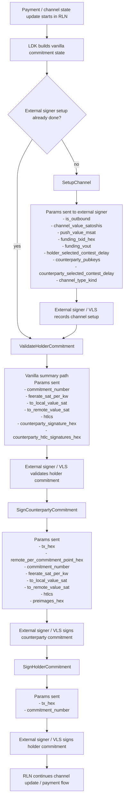

# External Signer Channel Transfer Flows

This note compares the **vanilla Lightning channel transfer flow** and the **RGB channel transfer flow** when RLN uses an **attached external signer**.

The goal is narrow:
- show the operational steps on the RLN <-> external-signer boundary
- highlight the **extra steps** and **extra parameters** we had to add for RGB
- make clear which additions are generic external-signer fixes and which are RGB-specific

Relevant code:
- `src/signer/channel_signer.rs`
- `src/signer/proto.rs`
- `src/signer/mod.rs`
- `rust-lightning/lightning/src/ln/channel.rs`
- `rust-lightning/lightning/src/ln/chan_utils.rs`
- `rust-lightning/lightning/src/sign/mod.rs`
- `rust-lightning/lightning/src/rgb_utils/mod.rs`

## Summary

### Generic external-signer additions
These are not RGB-specific, but they were required for the external-signer path to be correct:
- `SetupChannel.push_value_msat`
  - carried in `SetupChannelV1`
  - used so VLS validates the initial commitment against the real opener/peer balance split

### RGB-specific external-signer additions
These are the key deltas that vanilla channels do not need:
- `ValidateHolderCommitment.commitment_unsigned_tx_hex`
  - full unsigned holder commitment tx, consensus-serialized as hex
  - required because RGB commitment tx layout differs from the vanilla reconstructed summary path
- `ValidateHolderCommitment.commitment_psbt_output_witness_scripts_hex`
  - per-output witness scripts from PSBT / commitment construction
  - required so the external signer can validate the same scripts RLN/LDK used
- `SignCounterpartyCommitment.commitment_psbt_output_witness_scripts_hex`
  - same witness-script context, carried into counterparty commitment signing
- LDK-side witness-script extraction / installation before holder validation
  - without this, RLN had no way to send the scripts over the external-signer boundary
- RGB wallet coloring steps on commitment / HTLC / closing paths
  - these happen in `rust-lightning::rgb_utils` and are part of making the actual RGB tx shape valid

## Diagram 1: Vanilla Channel Transfer Flow

### Vanilla notes
- The vanilla flow works primarily from a **summary of the commitment state**.
- The signer does not need the full unsigned commitment tx bytes for holder validation.
- The signer does not need per-output PSBT witness scripts.
- `push_value_msat` still matters during `SetupChannel` for correct initial balance validation.

## Diagram 2: RGB Channel Transfer Flow

```mermaid
flowchart TD
    A[RGB payment / RGB channel state update starts in RLN] --> B[LDK builds RGB-shaped commitment tx]
    B --> B1[RGB runtime may color commitment / HTLC / closing tx path]
    B1 --> C{External signer setup already done?}
    C -- no --> D[SetupChannel]
    D --> D1[Same setup params as vanilla\nplus correct derived push_value_msat]
    D1 --> E[External signer / VLS records channel setup]
    C -- yes --> F
    E --> F[LDK extracts / installs per-output witness scripts]
    F --> G[ValidateHolderCommitment]
    G --> G1[Summary params still sent\n- commitment_number\n- feerate_sat_per_kw\n- to_local_value_sat\n- to_remote_value_sat\n- htlcs\n- counterparty_signature_hex\n- counterparty_htlc_signatures_hex]
    G1 --> G2[RGB-only extra params sent\n- commitment_unsigned_tx_hex\n- commitment_psbt_output_witness_scripts_hex]
    G2 --> H[External signer / VLS validates the real RGB holder commitment tx]
    H --> I[SignCounterpartyCommitment]
    I --> I1[Standard params sent\n- tx_hex\n- remote_per_commitment_point_hex\n- commitment_number\n- feerate_sat_per_kw\n- to_local_value_sat\n- to_remote_value_sat\n- htlcs\n- preimages_hex]
    I1 --> I2[RGB-only extra param sent\n- commitment_psbt_output_witness_scripts_hex]
    I2 --> J[External signer / VLS signs counterparty commitment against RGB-aware context]
    J --> K[SignHolderCommitment]
    K --> K1[Params sent\n- tx_hex\n- commitment_number]
    K1 --> L[External signer / VLS signs holder commitment]
    L --> M[RLN continues RGB channel update / payment flow]
```

## Why RGB forced additional work

Vanilla external-signer integration was mostly an **adapter problem**:
- serialize the existing LDK signer inputs
- call the external signer
- deserialize the response

RGB changed that.

For RGB commitments, the signer boundary was no longer rich enough because:
- the real commitment tx can differ from the vanilla reconstructed summary path
- witness-script context used by RLN/LDK was not present on the external-signer wire
- RGB coloring changes the tx shape that the signer must validate and sign

That is why we had to add both:
- **new wire parameters** in `src/signer/proto.rs`
- **new extraction / installation logic** in patched `rust-lightning`

## Exact fields we were forced to add or rely on

### 1. `SetupChannel.push_value_msat`
Location:
- `src/signer/proto.rs` -> `SetupChannelV1.push_value_msat`
- `src/signer/channel_signer.rs` -> `derive_initial_push_value_msat(...)`

Why:
- VLS uses the pushed amount to validate the initial commitment balance split.
- Hardcoding `0` breaks non-zero BTC push channel opens.

Scope:
- generic external-signer correctness
- not RGB-specific

### 2. `ValidateHolderCommitment.commitment_unsigned_tx_hex`
Location:
- `src/signer/proto.rs` -> `ValidateHolderCommitmentV1.commitment_unsigned_tx_hex`
- populated from `src/signer/channel_signer.rs`

Why:
- summary-only validation is insufficient when the real holder commitment tx has RGB-specific layout differences
- external signer must validate the exact tx RLN built

Scope:
- RGB-specific

### 3. `ValidateHolderCommitment.commitment_psbt_output_witness_scripts_hex`
Location:
- `src/signer/proto.rs` -> `ValidateHolderCommitmentV1.commitment_psbt_output_witness_scripts_hex`
- installed / taken through `lightning::rgb_utils::*holder_validate*_witness_scripts_hex`

Why:
- the external signer needs the same per-output witness-script context used in RLN/LDK
- this was not available on the old summary-only boundary

Scope:
- RGB-specific

### 4. `SignCounterpartyCommitment.commitment_psbt_output_witness_scripts_hex`
Location:
- `src/signer/proto.rs` -> `SignCounterpartyCommitmentV1.commitment_psbt_output_witness_scripts_hex`

Why:
- counterparty commitment signing also needs the RGB-aware witness/script context

Scope:
- RGB-specific

## Practical interpretation

If you ask what changed between vanilla and RGB for external signers, the answer is:
- vanilla mostly works with **commitment summaries**
- RGB needs **wire-tx fidelity** and **witness-script fidelity** across the signer boundary

That is the reason the RGB external-signer work spilled beyond `src/signer/*` into:
- `rust-lightning` signer hooks
- `rust-lightning::rgb_utils`
- some RLN runtime glue
